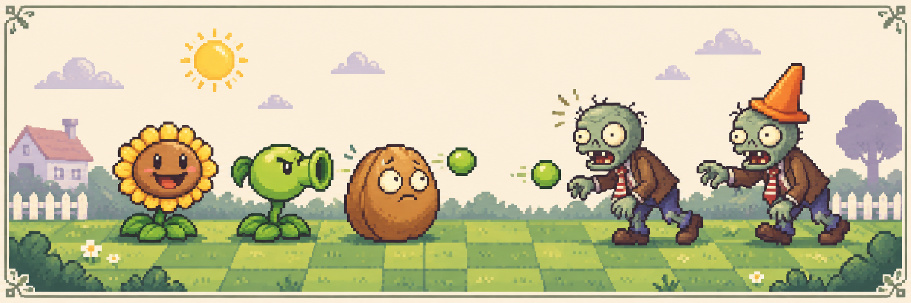

<div align="right">

[中文](README.md) · **English**

</div>

<div align="center">

# PVZ · Console Edition

**A character-grid lawn. Twelve plant cards.**

`C++` · `Windows Console` · `Keyboard Only`

[Build & run](docs/BUILD.md) · [Controls](docs/PLAYBOOK.md) · [Almanac](docs/ALMANAC.md) · [Code tour](docs/ARCHITECTURE.md)

</div>



<p align="center"><sub>README cover illustration. The actual game runs in a Windows text console.</sub></p>

**7 × 5 lawn · 12 plant types · 11 zombie types · Endless mode**

[](https://github.com/yuanjuju/pvz-self-created/actions/workflows/build.yml)

## 01 / PRESS START

Pick a card, move the cursor and plant. Sunlight and cooldowns are managed by the store; projectiles move through the character grid while zombies enter from the right. This C++ learning project implements selected tower-defense mechanics using Win32 console output, class inheritance and a single-threaded game loop.

The current entry path includes a cover, story dialogue, endless mode and character notes. Existing text and sound assets are preserved. The pixel artwork above is a new README illustration, not a screenshot or an in-game graphics upgrade.

## 02 / PLAYER ONE

| Input | Action |
| --- | --- |
| `1`–`9`, `A`–`C` | Select one of the twelve plant cards |
| Arrow keys | Move the placement / shovel cursor |
| `Enter` | Confirm placement or removal |
| `X` | Enter shovel mode |
| `Esc` | Cancel placement / removal |
| `Space` | Pause or resume |

Successful planting spends sunlight and starts the card cooldown. [Controls and current limitations →](docs/PLAYBOOK.md)

## 03 / FIELD NOTES

| Plant | Cost | Role |
| --- | ---: | --- |
| 🌻 Sunflower | 50 | Sunlight production |
| 🟢 Peashooter | 100 | Ranged attacks |
| 🥜 Wall-nut | 50 | Blocking |
| ❄️ Snow Pea | 175 | Damage and slowing |
| 🍒 Cherry Bomb | 150 | Area attack |
| 🌶️ Jalapeno | 125 | Lane attack |

[Full plant and zombie almanac →](docs/ALMANAC.md)

## 04 / BUILD & RUN

With Windows, MSVC and CMake, from the repository root:

```bat
cmake -S . -B build -A x64
cmake --build build --config Release
cd build\Release
chcp 936
pvz.exe
```

CMake stages the existing text and sound files beside the executable. Chinese strings retain their GBK encoding; `chcp 936` changes the current console code page. Start from the executable directory so relative asset paths resolve.

Windows CI compiles the project and checks runtime files. It does not perform an interactive playthrough or verify audio playback. See the [build guide](docs/BUILD.md) and [verification record](docs/VERIFICATION.md).

## 05 / UNDER THE HOOD

`Game` coordinates input and updates; `Map / Grid` handles positions and repainting; `Plant` and `Zombie` subclasses define entity behavior; `Bullet` handles movement and collisions; `Store` manages resources and cooldowns.

[Architecture and known technical limitations →](docs/ARCHITECTURE.md)

[Original README](docs/archive/README.original.md) · [Artwork provenance](docs/ARTWORK.md)

Save systems, multiple levels, Vasebreaker and conveyor-belt modes mentioned in the historical README are not advertised as verified features of the current implementation. This is a learning / fan project; original characters and materials belong to their respective rights holders. The new illustration does not imply official affiliation.
