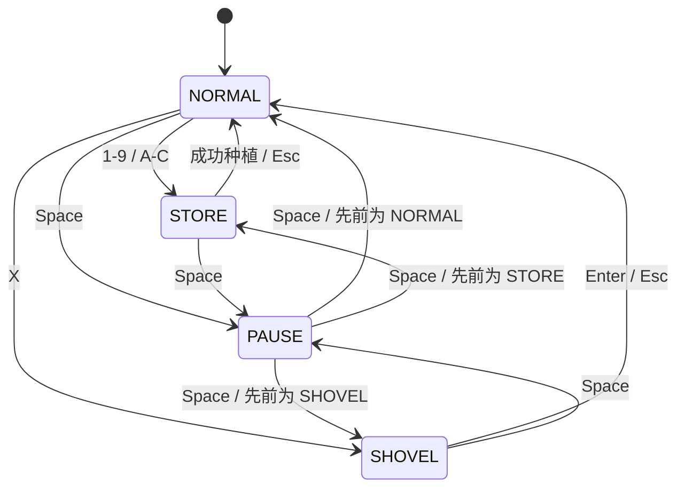

# UNDER THE HOOD · 控制台背后的 C++

[回到草坪](../README.md) · [编译运行](BUILD.md)

## 对象分工

| 对象 | 主要责任 | 源码 |
| --- | --- | --- |
| `Game` | 输入状态、循环顺序、僵尸与子弹队列、计分 | [Game.cpp](../Game.cpp) |
| `Map / Grid` | 格子索引、植物与僵尸位置引用、局部刷新 | [Map.cpp](../Map.cpp) |
| `Plant` 派生类 | 发射、生产、爆破、阻挡等行为 | [Plant.cpp](../Plant.cpp) |
| `Zombie` 派生类 | 移动、攻击、减速、跳跃和召唤等差异 | [Zombie.cpp](../Zombie.cpp) |
| `Bullet / SnowBullet` | 移动、碰撞、伤害与减速 | [Bullet.cpp](../Bullet.cpp) |
| `Store / PlantCard` | 阳光、价格、购买条件、冷却与选卡 | [Store.cpp](../Store.cpp) |
| `ui_tools` | Win32 光标、控制台颜色、窗口和音效 | [ui_tools.cpp](../ui_tools.cpp) |

这是对象继承与单线程循环驱动的控制台程序。当前结构没有 ECS、渲染线程、网络同步或跨平台窗口层。

## 一轮更新

对应 `Game::loop()`。植物或僵尸阶段可触发退出，因此图示表达正常迭代顺序。计时主要依赖计数器与额外 Sleep，并非采用真实经过时间补偿的固定时间步模拟。

## 输入状态

`pause()` 保存并恢复进入前状态；因此暂停后会回到原来的选卡或铲除位置。

## 内存与平台边界

- Game 队列与 Grid 使用原始指针关联实体，部分删除由 Game 完成，植物由格子管理。当前尚未统一为智能指针所有权。
- Plant / Zombie 基类存在虚函数，但未声明虚析构；后续整理生命周期时需一起处理，不能把现有实现描述为已验证的内存安全设计。
- `Game::delPlant()` 坐标判断存在变量混用，是已记录的玩法限制。
- Win32 / conio / WinMM 负责终端输入、显示与声音；macOS、Linux 不能直接运行此构建目标。

## 本次改动

新增 CMake 与 Windows CI，按现有 GBK 源码指定代码页 936；将音效文件名参数改为 `const char[]`；调整 Windows 头文件与命名空间导入顺序，解决新工具链下 `byte` 与 `std::byte` 歧义。没有替换实体行为、平衡数值或游戏模式。
